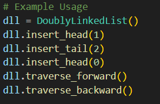
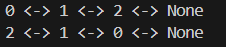
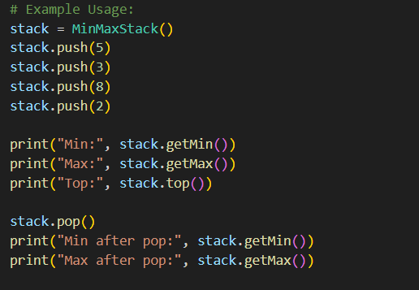
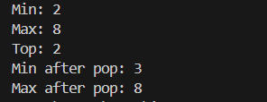
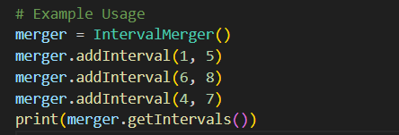
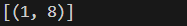
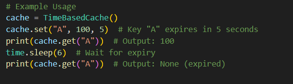

# IEEE_CC : Composite Data Structure Implementations

This project includes multiple data structure implementations, each optimized for specific operations and efficiency.

# LEVEL 0 : Basic Data Structure – Doubly Linked List

**Operations:**  
✔ Insert at head and tail  
✔ Forward and backward traversal  

**Complexities:**  
Insert at head/tail → O(1)  
Traverse forward/backward → O(n)  
Space Complexity → O(n)  

**Use-Cases**  
  
  

# LEVEL 1 : Custom Data Structure – Stack

**Operations:**  
✔ Push and Pop  
✔ Retrieve Top Element  
✔ Get Minimum and Maximum in O(1)  

**Complexities**  
Push, Pop, Top, GetMin, GetMax → O(1)  
Space Complexity → O(n)  

**Use-Cases**  
   
  

# LEVEL 2 : Composite Data Structure – Interval Merger

**Operations:**  
✔ Add interval and merge overlapping ones  
✔ Retrieve sorted, non-overlapping intervals  

**Complexities**  
Add Interval → O(log n)  
Merge & Get Intervals → O(n)  
Space Complexity → O(n)  

**Use-Cases**  
  
  

# LEVEL 3: Composite Data Structure – Time-Based Cache

**Operations:**  
✔ Store key-value pairs with expiration timestamps  
✔ Retrieve values only if they haven’t expired  
✔ Automatic removal of expired keys  

**Complexities:**  
Set (Insert Key with Expiry) → O(log n)  
Get (Retrieve Value if Not Expired) → O(log n)  
Automatic Expiry Removal → O(log n)  
Space Complexity → O(n)  

**Use-Cases**  
  
  